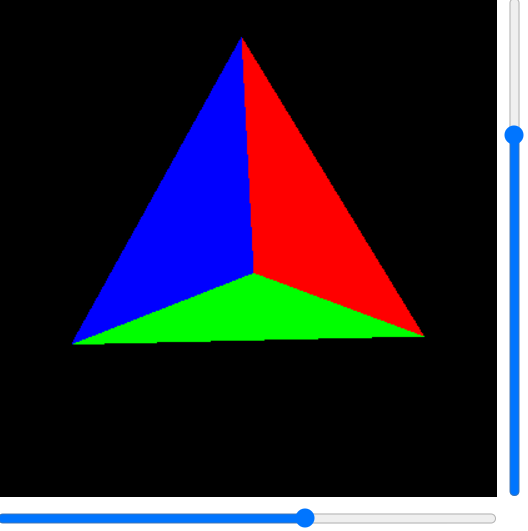

# Документация

## Tехническое руководство

Движки 3D-рендеринга, которые сегодня используются в играх и производстве мультимедиа, поражают сложностью используемой математики и программирования. Результаты, которые они дают, соответственно, ошеломляют.

Многие разработчики могут подумать, что создание даже самого простого 3D-приложения с нуля требует нечеловеческих знаний и усилий, но, к счастью, это не всегда так. Здесь хотелось бы поделиться с вами тем, как вы можете создать свой собственный движок 3D-рендеринга, полностью способный создавать красивые 3D-изображения.

Почему вы хотите создать 3D-движок? По крайней мере, это действительно поможет понять, как настоящие современные движки творят свою черную магию. Также иногда полезно добавить возможности 3D-рендеринга в ваше приложение, не прибегая к огромным внешним зависимостям. В случае Java это означает, что вы можете создать приложение для просмотра 3D-изображений с нулевыми зависимостями (кроме Java API), которое будет работать практически в любом месте и поместится в 50 кбайт!

Здесь я расскажу об основах 3d-рендеринга с использованием ортогональной проекции, простой треугольной растеризации, z-буферизации и плоского затенения. Я не буду заострять внимание на значительной оптимизации производительности и более сложных темах, таких как текстуры или различные настройки освещения - если вам это нужно, рассмотрите возможность использования более подходящих инструментов для этого, таких как OpenGL (существует множество библиотек, которые позволяют вам работать с OpenGL даже из Java).

**GUI wrapper**

Прежде всего, мы хотим разместить хоть что-то на экране. Для этого я буду использовать очень простое приложение с нашим визуализированным изображением и двумя ползунками для регулировки поворота.

```java
import javax.swing.*;
import java.awt.*;

public class DemoViewer {

    public static void main(String[] args) {
        JFrame frame = new JFrame();
        Container pane = frame.getContentPane();
        pane.setLayout(new BorderLayout());

        // Ползунок для управления горизонтальным вращением
        JSlider headingSlider = new JSlider(0, 360, 180);
        pane.add(headingSlider, BorderLayout.SOUTH);

        // Ползунок для управления вертикальным вращением
        JSlider pitchSlider = new JSlider(SwingConstants.VERTICAL, -90, 90, 0);
        pane.add(pitchSlider, BorderLayout.EAST);

        // Панель для отображения результатов рендеринга
        JPanel renderPanel = new JPanel() {
                public void paintComponent(Graphics g) {
                    Graphics2D g2 = (Graphics2D) g;
                    g2.setColor(Color.BLACK);
                    g2.fillRect(0, 0, getWidth(), getHeight());

                    // рендеринг будет происходить здесь
                }
            };
        pane.add(renderPanel, BorderLayout.CENTER);

        frame.setSize(400, 400);
        frame.setVisible(true);
    }
}
```

Окно с результатом должно выглядеть следующим образом:


Теперь давайте добавим несколько основных классов моделей - вершины и треугольники. Вершина - это просто структура для хранения наших трех координат (X, Y и Z), а треугольник связывает вместе три вершины и сохраняет их цвет.

```java
class Vertex {
    double x;
    double y;
    double z;
    Vertex(double x, double y, double z) {
        this.x = x;
        this.y = y;
        this.z = z;
    }
}

class Triangle {
    Vertex v1;
    Vertex v2;
    Vertex v3;
    Color color;
    Triangle(Vertex v1, Vertex v2, Vertex v3, Color color) {
        this.v1 = v1;
        this.v2 = v2;
        this.v3 = v3;
        this.color = color;
    }
}
```

Я буду считать, что координата X означает движение в направлении влево-вправо, Y означает движение вверх-вниз по экрану, а Z будет глубиной (таким образом, ось Z перпендикулярна вашему экрану). Положительная Z будет означать "по направлению к наблюдателю".

В качестве примера объекта я выбрал тетраэдр, поскольку это самая простая трехмерная фигура, которую я смог придумать, - для ее описания требуется всего 4 треугольника.

Код очень прост - мы просто создаем 4 треугольника и добавляем их в список:

```java
List tris = new ArrayList<>();
tris.add(new Triangle(new Vertex(100, 100, 100),
                      new Vertex(-100, -100, 100),
                      new Vertex(-100, 100, -100),
                      Color.WHITE));
tris.add(new Triangle(new Vertex(100, 100, 100),
                      new Vertex(-100, -100, 100),
                      new Vertex(100, -100, -100),
                      Color.RED));
tris.add(new Triangle(new Vertex(-100, 100, -100),
                      new Vertex(100, -100, -100),
                      new Vertex(100, 100, 100),
                      Color.GREEN));
tris.add(new Triangle(new Vertex(-100, 100, -100),
                      new Vertex(100, -100, -100),
                      new Vertex(-100, -100, 100),
                      Color.BLUE));
```

Итоговая фигура центрируется в начале координат (0, 0, 0), что довольно удобно, так как позже мы будем выполнять вращение вокруг этой точки.

Теперь давайте выведем это на экран. Пока что мы проигнорируем вращение и просто покажем каркас. Поскольку мы используем ортогональную проекцию, это довольно просто - просто отбросьте координату Z и нарисуйте полученные треугольники.

```java
g2.translate(getWidth() / 2, getHeight() / 2);
g2.setColor(Color.WHITE);
for (Triangle t : tris) {
    Path2D path = new Path2D.Double();
    path.moveTo(t.v1.x, t.v1.y);
    path.lineTo(t.v2.x, t.v2.y);
    path.lineTo(t.v3.x, t.v3.y);
    path.closePath();
    g2.draw(path);
}
```

Обратите внимание, как я применил перевод перед рисованием всех треугольников. Это сделано для того, чтобы поместить начало координат (0, 0, 0) в центр нашей области рисования - изначально двумерное начало координат находится в верхнем левом углу экрана. Результат должен выглядеть следующим образом:


Теперь нам нужно добавить поворот. Для этого мне нужно немного отвлечься и рассказать об использовании матриц для преобразования трехмерных точек.

Существует множество возможных способов манипулирования трехмерными точками, но наиболее гибким является использование матричного умножения. Идея состоит в том, чтобы представить ваши точки в виде векторов 3х1, а преобразование - это просто умножение на матрицу 3х3.

Вы берете свой входной вектор A и умножаете его на матрицу преобразования T, чтобы получить выходной вектор B:


Вы не можете описать все возможные преобразования, используя матрицы 3х3 - например, перевод запрещен. Вы можете добиться этого с помощью матриц 4х4, эффективно выполняя перекос в 4D-пространстве, но это выходит за рамки данного руководства.

Наиболее полезными преобразованиями, которые нам понадобятся в этом уроке, являются масштабирование и поворот.

Любое вращение в трехмерном пространстве может быть выражено как комбинация трех примитивных вращений: вращение в плоскости XY, вращение в плоскости YZ и вращение в плоскости XZ. Мы можем выписать матрицы преобразования для каждого из этих вращений следующим образом:

Матрица вращения ху :

$$ \begin{bmatrix}
cosθ & −sinθ & 0 \\\
sinθ & cosθ & 0 \\\
0 & 0 & 1 \end{bmatrix}
$$
 
Матрица вращения YZ:

$$ \begin{bmatrix}
1 & 0 & 0 \\\
0 & cosθ & sinθ \\\
0 & -sinθ & cosθ \end{bmatrix}
$$
 
Матрица вращения XZ:

$$ \begin{bmatrix}
cosθ & 0 & -sinθ \\\
0 & 1 & 0 \\\
sinθ & 0 & cosθ \end{bmatrix}
$$

Вот в чем волшебство: если вам нужно сначала повернуть точку в плоскости XY, используя матрицу преобразования T₁
, а затем повернуть ее в плоскости YZ, используя матрицу преобразования T₂
, вы можете просто умножить T₁
на T₂
и получить единую матрицу, описывающую весь поворот:

(AT₁)T₂=A(T₁ T₂)
 
Это очень полезная оптимизация - вместо повторного вычисления нескольких поворотов для каждой точки, вы предварительно вычисляете матрицу один раз, а затем используете ее в своем конвейере.

Хватит этих страшных математических штучек, давайте вернемся к коду. Мы создадим служебный класс Matrix3, который будет обрабатывать матричное и векторно-матричное умножение:

```java
class Matrix3 {
    double[] values;
    Matrix3(double[] values) {
        this.values = values;
    }
    Matrix3 multiply(Matrix3 other) {
        double[] result = new double[9];
        for (int row = 0; row < 3; row++) {
            for (int col = 0; col < 3; col++) {
                for (int i = 0; i < 3; i++) {
                    result[row * 3 + col] +=
                        this.values[row * 3 + i] * other.values[i * 3 + col];
                }
            }
        }
        return new Matrix3(result);
    }
    Vertex transform(Vertex in) {
        return new Vertex(
            in.x * values[0] + in.y * values[3] + in.z * values[6],
            in.x * values[1] + in.y * values[4] + in.z * values[7],
            in.x * values[2] + in.y * values[5] + in.z * values[8]
        );
    }
}
```

Теперь мы можем задействовать наши ползунки поворота. Горизонтальный ползунок будет управлять "направлением" - в нашем случае поворотом в направлении XZ (влево-вправо), а вертикальный ползунок будет управлять "шагом" - поворотом в направлении YZ (вверх-вниз).

Давайте создадим нашу матрицу вращения и добавим ее в наш конвейер:

```java
double heading = Math.toRadians(headingSlider.getValue());
Matrix3 transform = new Matrix3(new double[] {
        Math.cos(heading), 0, -Math.sin(heading),
        0, 1, 0,
        Math.sin(heading), 0, Math.cos(heading)
    });

g2.translate(getWidth() / 2, getHeight() / 2);
g2.setColor(Color.WHITE);
for (Triangle t : tris) {
    Vertex v1 = transform.transform(t.v1);
    Vertex v2 = transform.transform(t.v2);
    Vertex v3 = transform.transform(t.v3);
    Path2D path = new Path2D.Double();
    path.moveTo(v1.x, v1.y);
    path.lineTo(v2.x, v2.y);
    path.lineTo(v3.x, v3.y);
    path.closePath();
    g2.draw(path);
}
```

Вам также нужно будет добавить прослушиватели на ползунках заголовка и высоты тона, чтобы принудительно перерисовывать их при перетаскивании ручек:

```java
headingSlider.addChangeListener(e -> renderPanel.repaint());
pitchSlider.addChangeListener(e -> renderPanel.repaint());
```

Как вы, возможно, заметили, вращение вверх-вниз пока не работает. Давайте добавим следующее преобразование:

```java
Matrix3 headingTransform = new Matrix3(new double[] {
        Math.cos(heading), 0, Math.sin(heading),
        0, 1, 0,
        -Math.sin(heading), 0, Math.cos(heading)
    });
double pitch = Math.toRadians(pitchSlider.getValue());
Matrix3 pitchTransform = new Matrix3(new double[] {
        1, 0, 0,
        0, Math.cos(pitch), Math.sin(pitch),
        0, -Math.sin(pitch), Math.cos(pitch)
    });
Matrix3 transform = headingTransform.multiply(pitchTransform);
```

Обратите внимание, что теперь оба поворота работают и прекрасно сочетаются друг с другом:


До этого момента мы рисовали только каркас нашей фигуры. Теперь нам нужно начать заполнять эти треугольники каким-либо материалом. Для этого нам сначала нужно "растеризировать" треугольник - преобразовать его в список пикселей на экране, которые он занимает.

Я буду использовать относительно простой, но неэффективный метод - растеризацию по барицентрическим координатам. Реальные 3d-движки используют аппаратную растеризацию, которая очень быстра и эффективна, но мы не можем использовать графическую карту и поэтому будем делать это вручную в нашем коде.

Идея состоит в том, чтобы вычислить барицентрическую координату для каждого пикселя, который, возможно, находится внутри треугольника, и отбросить те, которые находятся снаружи. Следующий фрагмент реализует алгоритм. Обратите внимание, как мы начали использовать прямой доступ к пикселям изображения.

```java
BufferedImage img = 
    new BufferedImage(getWidth(), getHeight(), BufferedImage.TYPE_INT_ARGB);

for (Triangle t : tris) {
    Vertex v1 = transform.transform(t.v1);
    Vertex v2 = transform.transform(t.v2);
    Vertex v3 = transform.transform(t.v3);

    // Поскольку мы больше не используем Graphics2D,
    // нам приходится выполнять перевод вручную
    v1.x += getWidth() / 2;
    v1.y += getHeight() / 2;
    v2.x += getWidth() / 2;
    v2.y += getHeight() / 2;
    v3.x += getWidth() / 2;
    v3.y += getHeight() / 2;

    // Вычисление прямоугольных границ для треугольника
    int minX = (int) Math.max(0, Math.ceil(Math.min(v1.x, Math.min(v2.x, v3.x))));
    int maxX = (int) Math.min(img.getWidth() - 1, 
                              Math.floor(Math.max(v1.x, Math.max(v2.x, v3.x))));
    int minY = (int) Math.max(0, Math.ceil(Math.min(v1.y, Math.min(v2.y, v3.y))));
    int maxY = (int) Math.min(img.getHeight() - 1,
                              Math.floor(Math.max(v1.y, Math.max(v2.y, v3.y))));

    double triangleArea =
       (v1.y - v3.y) * (v2.x - v3.x) + (v2.y - v3.y) * (v3.x - v1.x);

    for (int y = minY; y <= maxY; y++) {
        for (int x = minX; x <= maxX; x++) {
            double b1 = 
              ((y - v3.y) * (v2.x - v3.x) + (v2.y - v3.y) * (v3.x - x)) / triangleArea;
            double b2 =
              ((y - v1.y) * (v3.x - v1.x) + (v3.y - v1.y) * (v1.x - x)) / triangleArea;
            double b3 =
              ((y - v2.y) * (v1.x - v2.x) + (v1.y - v2.y) * (v2.x - x)) / triangleArea;
            if (b1 >= 0 && b1 <= 1 && b2 >= 0 && b2 <= 1 && b3 >= 0 && b3 <= 1) {
                img.setRGB(x, y, t.color.getRGB());
            }
        }
    }

}

g2.drawImage(img, 0, 0, null);
```

Теперь на наших дисплеях появился цветной тетраэдр:



Если вы поиграете с ползунками, то заметите, что не все так просто - например, синий треугольник всегда находится выше других. Это происходит потому, что в данный момент мы рисуем треугольники один за другим, а синий треугольник последний - таким образом, он закрашен поверх всех остальных.

Чтобы исправить это, я введу концепцию z-буфера (или буфера глубины). Идея заключается в создании промежуточного массива во время растеризации, который будет хранить глубину последнего просмотренного элемента в любом заданном пикселе. При растеризации треугольников мы будем проверять, чтобы глубина пикселя была меньше, чем было показано ранее, и окрашивать пиксель только в том случае, если он находится выше других.

```java
double[] zBuffer = new double[img.getWidth() * img.getHeight()];
// инициализирование массива с чрезвычайно большими глубинами
for (int q = 0; q < zBuffer.length; q++) {
    zBuffer[q] = Double.NEGATIVE_INFINITY;
}

for (Triangle t : tris) {
    // обработка растеризации для каждого растеризованного пикселя:
    double depth = b1 * v1.z + b2 * v2.z + b3 * v3.z;
    int zIndex = y * img.getWidth() + x;
    if (zBuffer[zIndex] < depth) {
        img.setRGB(x, y, t.color.getRGB());
        zBuffer[zIndex] = depth;
    }
}
```

Теперь вы можете видеть, что у нашего тетраэдра на самом деле есть одна белая сторона:


Теперь у нас есть работающий конвейер рендеринга!

Но на этом мы не закончили. В реальной жизни воспринимаемый цвет поверхности меняется в зависимости от расположения источника света - если на поверхность падает лишь небольшое количество света, мы воспринимаем ее как более темную.

В компьютерной графике мы можем добиться аналогичного эффекта, используя так называемое "затенение" - изменение цвета поверхности в зависимости от угла наклона и расстояния до источников света.

Простейшей формой затенения является плоское затенение. При этом учитывается только угол между нормалью к поверхности и направлением источника света. Вам просто нужно найти косинус угла между этими двумя векторами и умножить цвет на полученное значение. Такой подход очень прост и дешев, поэтому его часто используют для высокоскоростного рендеринга, когда более продвинутые технологии затенения требуют слишком больших вычислительных затрат.

Сначала нам нужно вычислить вектор нормали для нашего треугольника. Если у нас есть треугольник ABC, мы можем вычислить его вектор нормали, вычислив перекрестное произведение векторов AB и AC, а затем разделив полученный вектор на его длину.

Перекрестное произведение - это бинарная операция над двумя векторами, которая определяется в трехмерном пространстве следующим образом:

u × v = [uₓ uᵧ u<sub>z</sub>] × [vₓ vᵧ v<sub>z</sub>] = [uᵧ × v<sub>z</sub> − u<sub>z</sub> × vᵧ u<sub>z</sub> × vₓ − uₓ × v<sub>z</sub> uₓ × vᵧ − uᵧ × vₓ]

Вот наглядное объяснение того, что делает перекрестное произведение:


```java
for (Triangle t : tris) {
    // преобразование вершины перед вычислением нормали

    Vertex norm = new Vertex(
         ab.y * ac.z - ab.z * ac.y,
         ab.z * ac.x - ab.x * ac.z,
         ab.x * ac.y - ab.y * ac.x
    );
    double normalLength =
        Math.sqrt(norm.x * norm.x + norm.y * norm.y + norm.z * norm.z);
    norm.x /= normalLength;
    norm.y /= normalLength;
    norm.z /= normalLength;
}
```

Теперь нам нужно вычислить косинус между нормалью треугольника и направлением света. Для простоты мы предположим, что наш источник света расположен непосредственно за камерой на некотором бесконечном расстоянии (такая конфигурация называется "направленный свет") - таким образом, направление нашего источника света будет [0 0 1].

Косинус угла между векторами можно вычислить по этой формуле:


где ||A|| это длина вектора, а A⋅B это скалярное произведение векторов:

A ⋅ B = [aₓ aᵧ a<sub>z</sub>] ⋅ [bₓ bᵧ b<sub>z</sub>] = aₓ × bₓ + aᵧ × bᵧ + a<sub>z</sub> × b<sub>z</sub>

Обратите внимание, что длина нашего вектора направления света ( [0 0 1]
 ) равна 1, как и длина нормали треугольника (мы уже нормализовали ее). Таким образом, формула просто становится:

cosθ = A ⋅ B = [aₓ aᵧ a<sub>z</sub>] ⋅ [bₓ bᵧ b<sub>z</sub>]
 
Также обратите внимание, что только Z-компонент светлый вектор направления не равно нулю, так можно еще более упростить:

cosθ = A ⋅ B = [aₓ aᵧ a<sub>z</sub>] ⋅ [0 0 1] = а<sub>z</sub>
 

Теперь код стал тривиальным:

```java
double angleCos = Math.abs(norm.z);
```

Мы удаляем знак из результата, потому что для наших простых целей нам все равно, какая сторона треугольника обращена к камере. В реальном приложении вам нужно будет отслеживать это и соответствующим образом применять затенение.

Теперь, когда у нас есть коэффициент затенения, мы можем применить его к цвету треугольника. Наивная версия может выглядеть следующим образом:

```java
public static Color getShade(Color color, double shade) {
    int red = (int) (color.getRed() * shade);
    int green = (int) (color.getGreen() * shade);
    int blue = (int) (color.getBlue() * shade);
    return new Color(red, green, blue);
}
```

Хотя это и даст нам некоторый эффект затенения, он будет исчезать гораздо быстрее, чем нам нужно. Это происходит потому, что Java использует цветовое пространство sRGB, которое уже масштабировано в соответствии с нашим логарифмическим восприятием цвета.

Итак, нам нужно преобразовать каждый цвет из масштабированного в линейный формат, применить оттенок, а затем преобразовать обратно в масштабированный формат. Реальное преобразование из sRGB в линейный RGB довольно сложное, поэтому я не буду приводить здесь полную спецификацию - только базовое приближение.

```java
public static Color getShade(Color color, double shade) {
    double redLinear = Math.pow(color.getRed(), 2.4) * shade;
    double greenLinear = Math.pow(color.getGreen(), 2.4) * shade;
    double blueLinear = Math.pow(color.getBlue(), 2.4) * shade;

    int red = (int) Math.pow(redLinear, 1/2.4);
    int green = (int) Math.pow(greenLinear, 1/2.4);
    int blue = (int) Math.pow(blueLinear, 1/2.4);

    return new Color(red, green, blue);
}
```

Понаблюдайте, как оживает наш тетраэдр:


Теперь у нас есть работающий движок 3d-рендеринга с цветами, освещением и затенением, и нам потребовалось около 200 строк кода - неплохо!

Мы можем быстро создать аппроксимация сферы из этого тетраэдра. Это можно сделать, многократно разделяя каждый треугольник на четыре меньших и "раздувая" их:

```java
public static List inflate(List tris) {
    List result = new ArrayList<>();
    for (Triangle t : tris) {
        Vertex m1 =
            new Vertex((t.v1.x + t.v2.x)/2, (t.v1.y + t.v2.y)/2, (t.v1.z + t.v2.z)/2);
        Vertex m2 =
            new Vertex((t.v2.x + t.v3.x)/2, (t.v2.y + t.v3.y)/2, (t.v2.z + t.v3.z)/2);
        Vertex m3 =
            new Vertex((t.v1.x + t.v3.x)/2, (t.v1.y + t.v3.y)/2, (t.v1.z + t.v3.z)/2);
        result.add(new Triangle(t.v1, m1, m3, t.color));
        result.add(new Triangle(t.v2, m1, m2, t.color));
        result.add(new Triangle(t.v3, m2, m3, t.color));
        result.add(new Triangle(m1, m2, m3, t.color));
    }
    for (Triangle t : result) {
        for (Vertex v : new Vertex[] { t.v1, t.v2, t.v3 }) {
            double l = Math.sqrt(v.x * v.x + v.y * v.y + v.z * v.z) / Math.sqrt(30000);
            v.x /= l;
            v.y /= l;
            v.z /= l;
        }
    }
    return result;
}
```

Вот что вы увидите:

